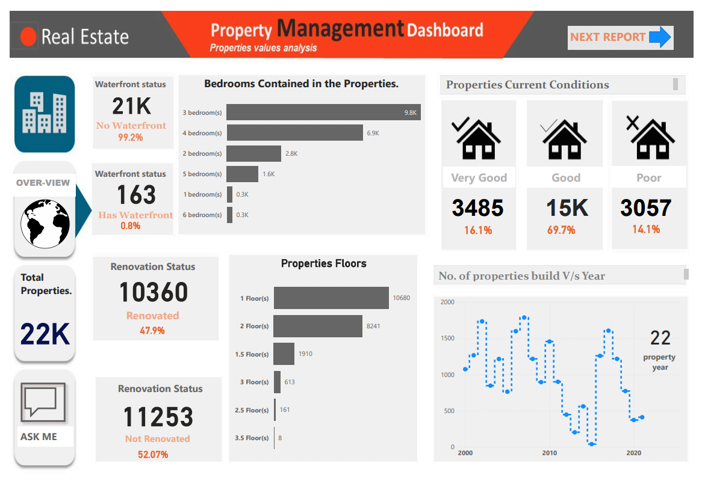
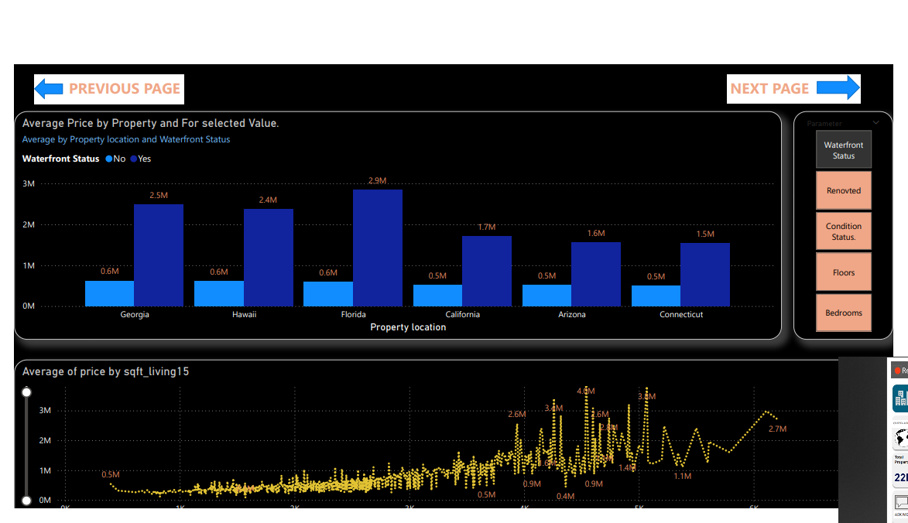
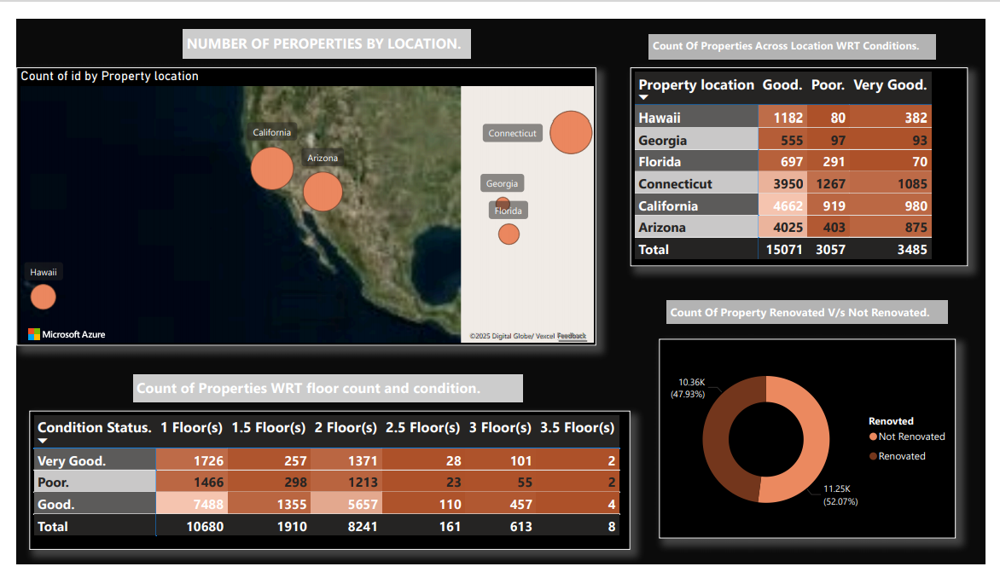

# Real Estate Analysis Project

## Overview
This project utilizes Power BI to analyze real estate data, providing insights into property characteristics, conditions, and pricing across various locations. The analysis focuses on key metrics such as the number of bedrooms, waterfront status, renovation status, and property conditions.







## Features
- **Property Characteristics**: Breakdown of properties by the number of bedrooms.
- **Waterfront Status**: Analysis of properties with and without waterfront access.
- **Renovation Status**: Comparison of renovated vs. not renovated properties.
- **Current Conditions**: Assessment of properties based on their condition (Very Good, Good, Poor).
- **Location Analysis**: Count of properties by location and their respective conditions.
- **Average Pricing**: Insights into average property prices based on location and waterfront status.

## Data Summary
- **Total Properties**: 22,000
- **Bedrooms Distribution**:
  - 1 Bedroom: 300
  - 2 Bedrooms: 2,800
  - 3 Bedrooms: 9,800
  - 4 Bedrooms: 6,900
  - 5 Bedrooms: 1,600
  - 6 Bedrooms: 300
- **Waterfront Status**:
  - Has Waterfront: 163 (0.8%)
  - No Waterfront: 21,000 (99.2%)
- **Renovation Status**:
  - Renovated: 11,253 (47.9%)
  - Not Renovated: 12,753 (52.07%)
- **Current Conditions**:
  - Very Good: 3,485 (16.1%)
  - Good: 15,000 (69.7%)
  - Poor: 3,057 (14.1%)

## Installation
1. Clone the repository:
   ```bash
   git clone https://github.com/mohamed-soss/real-estate-analysis.git
   ```
2. Open the Power BI Desktop application.
3. Load the data file from the `data` directory.
4. Explore the reports and dashboards created in Power BI.

## Usage
- Open the Power BI file to view interactive dashboards.
- Filter data based on various parameters such as location, waterfront status, and renovation status.
- Analyze trends over time and make data-driven decisions.

## Contributing
Contributions are welcome! Please follow these steps:
1. Fork the repository.
2. Create a new branch (`git checkout -b feature/YourFeature`).
3. Make your changes and commit them (`git commit -m 'Add some feature'`).
4. Push to the branch (`git push origin feature/YourFeature`).
5. Open a pull request.

## License
This project is licensed under the MIT License - see the [LICENSE](LICENSE) file for details.

## Acknowledgments
- Thanks to the contributors and the community for their support.
- Special thanks to the data providers for making this analysis possible.
